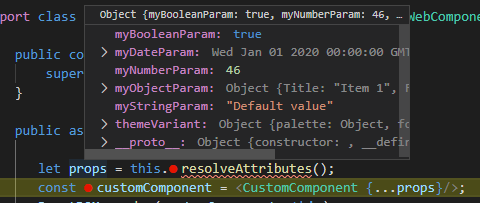

# Create a custom web component

## What is a web component?

A web component is a custom HTML element that can be used in your templates to implement complex behaviors. In the solution we used them here as *"wrappers"* for React components to be able to use them with Handlebars. More information about web components in general can be found [here](https://www.webcomponents.org/introduction).

{: .center}

## Web component creation process

Web component creation process comes in two distinct steps:

1. [Create the component class and its React sub components](#create-the-data-source-logic).
2. [Register the component information for discovery](#register-data-source-information).


### Create the component logic and sub components

A web component is typically composed of these parts:

* A web component class derived from the native `HTMLElement` class.
* A main React component to be rendered inside the web component.

To create new component:

* In your extensibility library project, create a new `MyComponent.ts` JSX file.
* Create a new class extending the abstract class `BaseWebComponent`. This class must have at least the `connectedCallback()` method from base interface `HTMLElement`.

```typescript
export class MyCustomComponentWebComponent extends BaseWebComponent {
   
    public constructor() {
        super(); 
    }
 
    public async connectedCallback() {
        ...
    }    
}
```

* Create a new regular React component (in the same file or a separate file and as class or hook):

```typescript
export interface IObjectParam {
    myProperty: string;
}

export interface ICustomComponentProps {

    /**
     * A sample string param
     */
    myStringParam?: IObjectParam;

    /***
     * A sample object param
     */
    myObjectParam?: string;
}

export interface ICustomComponenState {
}

export class CustomComponent extends React.Component<ICustomComponentProps, ICustomComponenState> {
    
    public render() {

        // Parse custom object
        const myObject: IObjectParam = this.props.myObjectParam;

        return <div>{this.props.myStringParam} {myObject.myProperty}</div>;
    }
}
```

In this solution, web components are considered **stateless**, meaning they will be entirely recreated when an attribute is changed (coming from the property pane). It means you can still use an internal state in your React components but not rely on the parent context (props) since it will be recreated every time by the Handlebars template if a property pane value is updated. The `componentDidMount()` method will be called every time in this case (not `componentDidUpdate()`).

* In your web component class, render your React component:

```typescript
public async connectedCallback() {

    let props = this.resolveAttributes();
    const customComponent = <CustomComponent {...props}/>;
    ReactDOM.render(customComponent, this);
} 
```

The `resolveAttributes()` method will look at all `data-*` HTML attributes in your web component custom element node and return a corresponding key/value pair object with values in their guessed type that you can pass directly to your React component as props. By convention, web component attributes have to be passed using **camel case** to be tranformed into React component props. For instance: a `data-my-string-param` HTML attribute becomes `myStringParam` prop.

Supported types for attributes are **boolean**, **string**, **date**, **number** and **object**. HTML attributes must use the **data-*** prefix to be retrieved correctly.

To pass JSON objects, you can use the `JSONstringify` Handlebars helper. If valid JSON, they will be returned as **objects** by the `resolveAttributes()` method.

**Example**
```html
<my-custom-component 
    data-my-string-param="Default value" 
    data-my-object-param="{{JSONstringify this 2}}"
    data-my-date-param="01/01/2020"
    data-my-number-param="46"
    data-my-boolean-param="true"
>
</my-custom-component>
```

{: .center}

### Register component information

The next step is to fill information about your new component. In the library main entry point (i.e. the class implementing the `IExtensibilityLibrary` in interface) return a new `IComponentDefinition` object in the `getCustomWebComponents()` method using these properties: 


| Property | Description |
| --------- | ---------- |
| `componentName` | The name for your component. This name will be used as the custom HTML element name (ex: `<my-custom-component>`).
| `componentClass` | The web component class for that component.

```typescript
public getCustomWebComponents(): IComponentDefinition<any>[] {
    return [
        {
            componentName: 'my-custom-component',
            componentClass: MyCustomComponentWebComponent
        }
    ];
}
```
