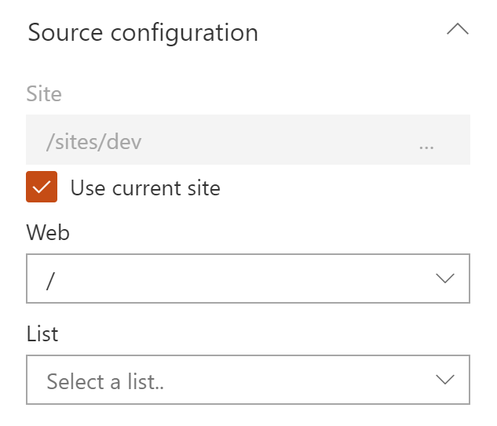

# 'SharePoint CAML' data source

The _'SharePoint CAML'_ data source allows you to rerieve items uisng a CAML query built using the interative builder or using an XML text.

## Source configuration

A CAML query always apply on a SharePoint list or document library. Thus, you must first select one using the following dropdowns:

| Setting | Description | Default value |
| ------- |---------------- | ---------- | ----------- |
| **Site** | The site collection containing the list or document library | By default, it uses the current site collection. However, you can disable the checkmark and search for a specific site. This control uses SharePoint search to get sites looking in the _Title_ and _Path_ managed properties. It means if your sites has been newly created it may not appear immediatly until indexed. | Current site collection.
| **Web** | The web containing the list. It can be the root web of the selected site collecion or an other subsite. | '/' (root web)
| **List** | The list where the CAML query will be applied. | None.

## CAML Query configuration

To build your CAML query, you have the choice to use the interactive builder or start from scratch using your own XML.

### Using the builder

| Setting | Description | Default value |
| ------- |---------------- | ---------- | ----------- |
| **View Fields** | The item fields to return from the. They will be available in your templates with the same name. | <ul><li>UniqueId</li><li>EncodedAbsUrl</li><li>FileRef</li><li>File_x0020_Type</li><li>FileLeafRef</li><li>Name</li><li>Author</li><li>Created</li></ul>
| **Order by field** | An optional field to sort results. | None.