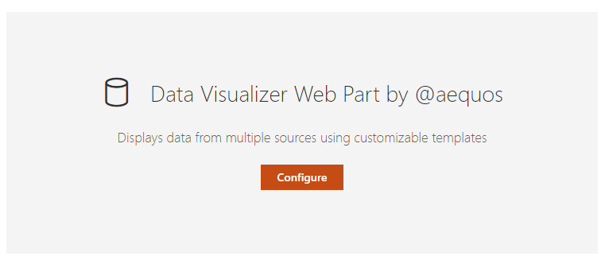
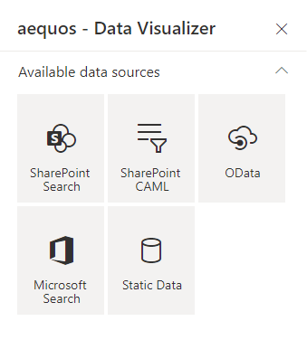

# Data Visualizer Web Part

The _'Data Visualizer' Web Part_ is the fundamental building block of whole global solution. Its purpose is to get data from a specifc source and render them in a specific native or custom layout based on Handlebars and web components.

This Web Part can be used **alone** or **connected to other Web Parts** to add dyanmic interactions (filters, search box or verticals).

## Use the Web Part alone

You can use this Web Part alone, without any connection, for instance just to rollup some data.

1. Edit your SharePoint modern page.
2. Search for the _'aequos - Data Visualizer'_ Web Part and add it to your page:

### 1. Select a data souce

The first page allows you to select a data source. By default, the following data sources are provided:

| Data source | Description |
|-------------|---|
| **SharePoint Search** | Retrieve data from the SharePoint search engine.
| **SharePoint CAML** | Retrieve data from a SharePoint list using a CAML query.
| **OData** | Retrieve data from an OData REST API such as **Microsoft Graph**, **Azure Active Directory API**, **SharePoint REST API (v1 or v2)** or **OData anonymous API**.
| **Static Data** | Gets data from a static JSON object defined in the Web Part.

### 2. Select a layout

## Use the Web Part with other Web Parts using connections