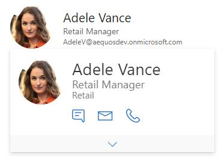

The 'people' layout display a list of persons with additional information. Typically, this layout is well suited for a people directory.

{: .center}

 By default, the user profile pictures are fetched from the SharePoint User Profile Service. If your user pictures are stored in Active Directoy, make sure you synchronized them with SharePoint User Profile Service. Otherwise, a placeholder image will be displayed.

| Setting | Description | Default value 
| ------- |---------------- | ----------
| **Manage people fields** | Allows you to define you own values for people placeholder fields. <br><p align="center">[](../../../../assets/webparts/data_visualizer/layouts/manage_people_fields.png)</p>As a field value, you can choose either a field property value (from the list or as free text) and without any transformation or use an Handlebars expression by clicking on the checkbox next to it. In this case, all helpers from the main template are available. Also, if the field doesn't have the **'Allow HTML'** indication flag enabled, it means the value will be always interpreted as text, regardless if you set an HTML value. Otherwise, your value will be interpreted as HTML for those fields (ex: '_Primary text_' placeholder field). For HTML fields you can use the special variable `@root.theme` to use theme colors (ex: `@root.theme.palette.themePrimary`) or `@root.slots.<SlotName>` to access slot value. If you don't set a value for those fields (i.e an empty value), they won't appear in the UI.</br>
| **Show persona card on hover** | If enabled, show a person card on hover for the current item. <p align="center">[](../../../../assets/webparts/data_visualizer/layouts/persona_card_hover.png)</p> This feature uses Microsoft Graph and [Microsoft Graph Toolkit](https://docs.microsoft.com/en-us/graph/toolkit/components/person) to display information about the user and needs the following API permissions in your tenant to work: <ul><li>User.Read</li><li>People.Read</li><li>Contacts.Read</li><li>User.ReadBasic.All</li></ul>**If these permissions are not set, the card won't appear**. You can use [PnP Office 365 CLI](https://pnp.github.io/office365-cli/cmd/spo/serviceprincipal/serviceprincipal-grant-add/) to add correct permissions for this feature:</br></br>`o365$ spo serviceprincipal grant add --resource '<aad_app_display_name>' --scope 'user_impersonation'`. Refer to the section below about [persona hover card customization](#persona-hover-card).
| **Component size** | The size of the person item (not only the picture). The more the size is and the more information will be displayed for each item and vice versa.

#### Persona hover card

Activating this option may slightly reduce loading performances because the user information are fecthed individually for each user (i.e result). **This option shouldn't be used with large page count.**

##### Microsoft Graph Toolkit

 The hover card uses Microsoft Graph Toolkit. This means you can add additional information providing your own template like this:

 ```html
 <mgt-person-card inherit-details>
    <template data-type="additional-details">
    <h3>Stuffed Animal Friends:</h3>
    <ul>
        <li>Giraffe</li>
        <li>lion</li>
        <li>Rabbit</li>
    </ul>
    </template>
</mgt-person-card>
 ```
More information [here](https://docs.microsoft.com/en-us/graph/toolkit/components/person-card).