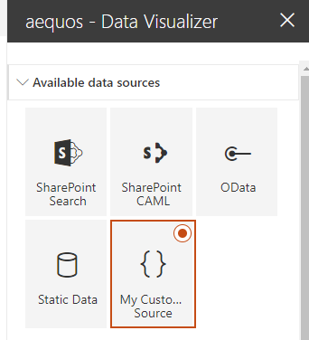

# Getting Started

The Modern Data Visualizer solution allows you to customize the Web Part behavior in several ways:

-   **Custom Data Source**: add your own data source options with personalized property pane fields
    
-   **Custom Layouts**: add you own layouts options with a custon Handlebars template
-   **Custom Web Components**: add you own components to be used in Handlebars template without the need to create a layout.

A starter project is available on GitHub to help you to start your library.

## Prepare your project

1. Create a new SharePoint Framework project of type ['Library Component'](https://docs.microsoft.com/en-us/sharepoint/dev/spfx/library-component-overview):

    `yo @microsoft/sharepoint --environment spo --component-type library --solution-name MyCompanyLibrary`

2. In the `package.json` file, add the following dependencies and run a `npm i`:

            ...
            "dependencies": {
                ...
                "@microsoft/sp-core-library": "1.9.1",
                "@microsoft/sp-property-pane": "1.9.1",
                "@microsoft/sp-webpart-base": "1.9.1",
                "@aequos/extensibility": "1.0.0",
                "typescript": "~3.3.0"
                ...
            },
            ...

3. In the `<your_library_name>.manifest.json` file, replace the `id` property by the value `dc4f961b-dbe0-44b4-982d-5776bf99d015`. This identifier is used to load dynamically the library from the Data Visualizer Web Part. Therefore, this value is **mandatory** to make the link. That is the only hook we need on your library.

            {
                // The value should be this id to make the link with the Web Part
                "id": "dc4f961b-dbe0-44b4-982d-5776bf99d015" /
                "alias": "MyCompanyLibraryLibrary",
                "componentType": "Library",

                ...
            }