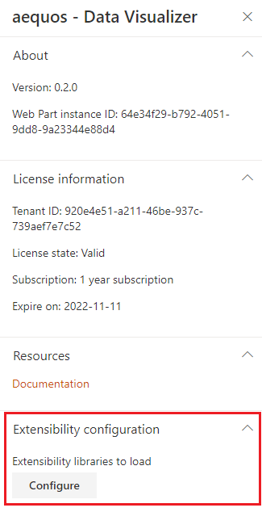
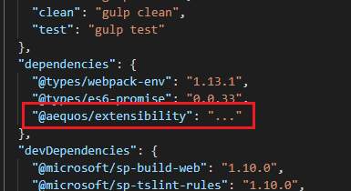
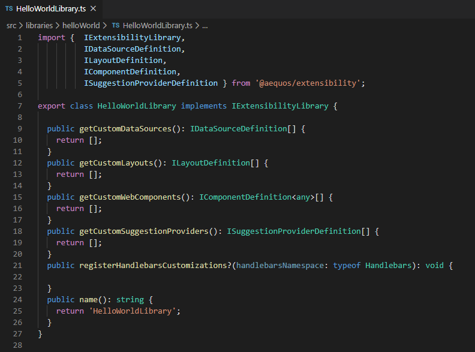

# Extensibility possibilities

This solution supports different levels of customizations depending your requirements:

- **'Basic' customizations**: these include custom settings for data sources, search box, verticals and filters Web Parts + minor updates to existing layouts by adding custom HTML markup (ex: add a custom field in the UI from a data source), updates to builtin layouts fields ('Cards','Details List' and 'People'), etc. **They only require HTML, CSS and Handlebars skills to be done**. Typically a super user or a webmaster could do that.
- **'Advanced' customizations**: these include major updates like adding a new data source, layout, component or suggestions provider. **These are build from scratch and require SharePoint Framework development skills to be done**. Typically, a front-end/SharePoint developer could do that.

## Basic customizations

'Basic' customizations cover the layout templates updates with HTML, CSS and Handlebars. Refer to the templating [documentation](./templating.md) to know more.

## Advanced customizations

The solution uses the concept of **'extensibility libraries'**. Basically, these are [SharePoint Framework library components](https://docs.microsoft.com/en-us/sharepoint/dev/spfx/library-component-tutorial) you put in the global or site collection app catalog that will be loaded automatically by Web Parts to enhance the experience and options (ex: new data source with new options, custom layout, etc.). Simple as that!

> As a demonstration of capabilities, all builtin data sources, layouts, web components or suggestions providers are built using **the same exact interfaces and methods** that are publically available in the [`@aequos/extensibility`](https://www.npmjs.com/package/@aequos/extensibility) npm package. We took no shortcuts or cheats whatsoever in our code so you could theorically get the same output!

> All documentation procedures for extensions are based on the demo extensibility library available in the GitHub repository that you can use as reference.

### Prerequistes

For your project to be a valid extensibility library, you must have the following prerequisites:

- Your project must be an [SPFx library component](https://docs.microsoft.com/en-us/sharepoint/dev/spfx/library-component-overview).
- The main entry point of your library must implement the `IExtensibilityLibrary` interface from the ['@aequos/extensibility' npm public package](https://www.npmjs.com/package/@aequos/extensibility).
- You library **manifest ID** must be registered in the Web Part where you want to use the extension.

### Supported extensions

Each Web Part type in the solution supports several extensions or no extension at all. It means even your extensibility library contains all possible extensions, they won't be loaded if the Web Part does not support them.

| Web Part type | Supported extensions |
| ------------- | -------------------- |
| **Data Visualizer** | <ul><li>Custom data sources.</li><li>Custom layouts.</li><li>Custom web components.</li><li>Custom Handlebars [customizations](https://handlebarsjs.com/api-reference/runtime.html) (ex: helpers, partials ,etc.).</li></ul>
| **Data Filters** |  <ul><li>Custom web components (_not directly but via the 'Data Visualizer' Web Part extensibility library registration_).</li></ul>
| **Search box** | <ul><li>Custom suggestions providers.</li></ul>
| **Data Verticals** | None.

### Register your extensibility library with a Web Part

When a Web Part type supports one or multiple extensions, you can register them going to the last property pane confguration page in the _'Extensibility configuration'_ section:

[{: .center}](../assets/extensibility/extensibility_configuration.png)

From here, you can add the manifest IDs of your libraries and decide to enable or disabled certain libraries. The manifest ID can be found in the `<your_library_name>.manifest.json` file:

[{: .center}](../assets/extensibility/library_manifest_id.png)

[{: .center}](../assets/extensibility/extensibility_configuration_manifest.png)

> Multiple librairies can be registred for a single Web Part instance allowing you to split your extensions into multiple projects (in the end, they will be all concatenated). For instance, this could be convenient when extensions come from different IT providers.

### Create an extensibility library

To create an extensibility library, you have the choice to reuse the one provided in the GitHub repository or start from scratch. In this case:

1. Create a new SharePoint Framework project of type 'Library' with `yo @microsoft/sharepoint`.
2. In your `package.json` add the ['@aequos/extensibility' npm public package](https://www.npmjs.com/package/@aequos/extensibility) (latest) and run `npm i`.
    {: .center}
3. In the main entry point, implement the `IExtensibilityLibrary` interface. Provide all method implementations (return empty arrays if you don't implement specific extensions).
    {: .center}
5. Implement your extension(s) depending of the type:
    - [Data source](./custom_data_source.md)
    - [Layout](./custom_layout.md)
    - [Web component](./custom_web_component.md)
    - [Suggestions providers](./custom_suggestions_provider.md)
    - [Handlebars customizations](./handlebars_customizations.md)

    Creation process always follows more or less the same pattern:

    1. Create the extension data logic or render logic.
    2. Register the information about the extension to be discovered and instanciated by the target Web Part by implementing the corresponding method according to the `IExtensibilityLibrary` interface.

6. Bundle `gulp bundle --ship` and package `gulp package-solution --ship` and add the solution to the global or site collection catalog (for this one, it must be the same site collection where the Web Part loading that extension(s) is present).
7. [Register your manifest ID in the target Web Part instance](#register-your-extensibility-library-with-a-web-part).
8. Enjoy!

#### Debug a library component

Debugging a library component is exactly the same as debugging an SPFx Web Part. Run `gulp serve` in the hosted workbench and put a _'Data Visualizer'_,_'Data Filters'_ or _'Search Box'_ Web Part depending the extension you want to test. If registered correctly, your breakpoints will be triggerred by the main Web Part loading your extension.

