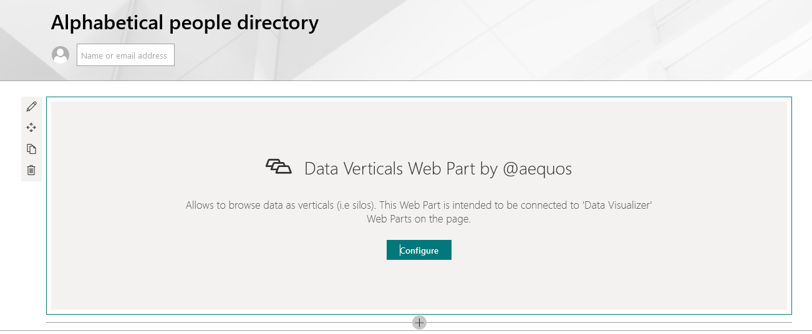
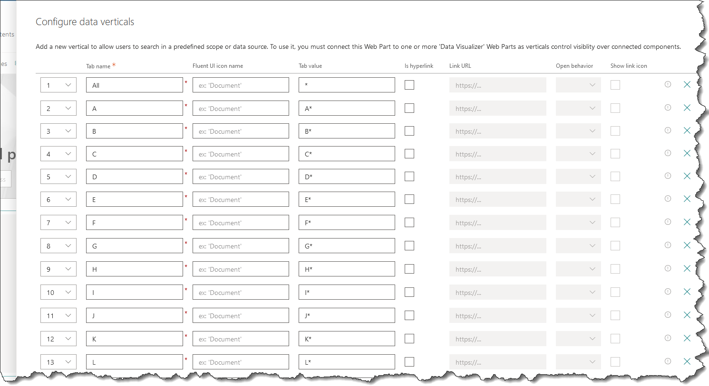
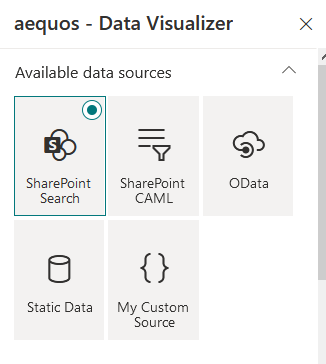
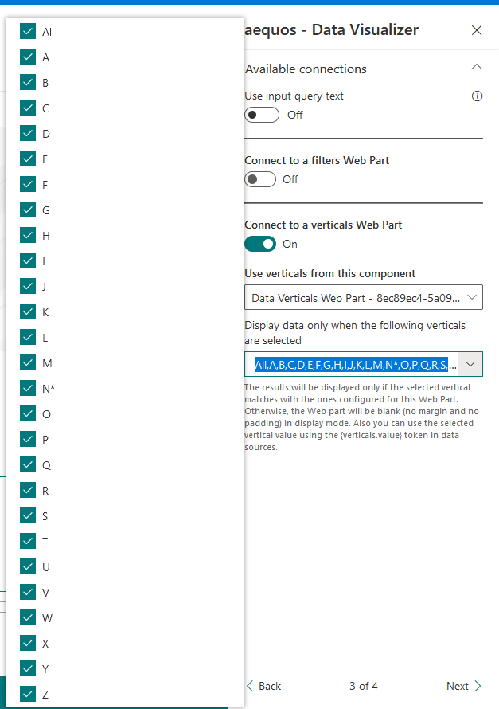
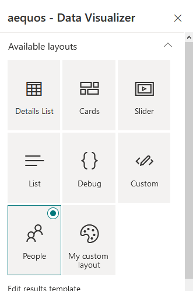
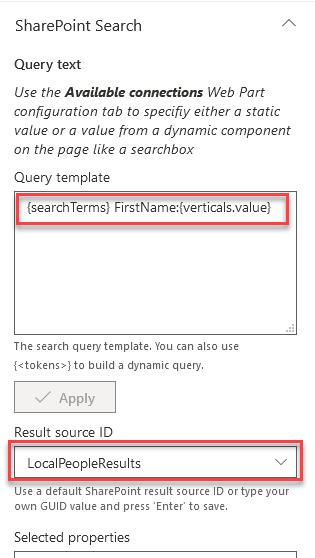
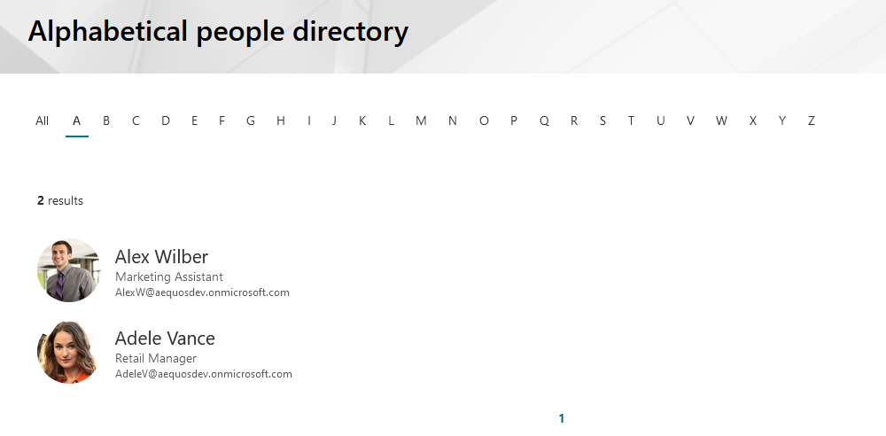

# Build a people directory using alphabetical verticals and SharePoint Search data source

This tutorial gives you basic steps to achieve a people directoy using alphabetical letters and the SharePoint search data source:

## Video tutorial

<iframe width="560" height="315" src="https://www.youtube.com/embed/SLbXneP3b6I" frameborder="0" allow="accelerometer; autoplay; encrypted-media; gyroscope; picture-in-picture" allowfullscreen></iframe>

## Step-by-step tutorial

1. Add the _'Data Verticals'_ Web Part on the page.

    {: .center} 

1. For each alphabetical letter, add and configure a new vertical. As the value use `<Letter> + *`. Example `A*` for letter **'A'**. You can also add an **'All'** tab by specifying `*` as value.

    {: .center} 

1. Add a new _'Data Visualizer'_ Web Part on the page.

    {: .center} 

1. Select the _'SharePoint Search'_ data source.

    {: .center} 

1. In the _'Connections'_ property pane configuration page, connect the _'Data Verticals'_ Web Part previously added. Select **all** the available tabs (i.e. letters). Basically it tells the Data Visualizer Web Part to be or remain visible when user clicks on any of these letters.

    {: .center} 

1. In _'Layouts'_ property pane configuration page, select the 'People' layout.

    {: .center}

    > Optionally, in the layout options, you can check _'Show persona card on hover'_ option. To get it work, [an administrator needs to approve required API permissions](../../installation).

    {: .center}

1. In the _'Data source'_ property pane configuration page, select the _'LocalPeopleResults'_ **Result Source** and update the **Query Template** property with the `{searchTerms} FirstName:{verticals.value}` expression. 

    {: .center}

    > This expression is given as an example. You can use the `{verticals.value}` token anywhere in the query according to your requirements. The value will be simply replaced dynamically.

1. Save your page. You can now filter people based on alphabetical letters using their first name.

    {: .center}

    > You can then add a _'Search Box'_ or _'Data Filters'_ Web Parts to complete the experience.