# Build a teams search app using aequos MDV, Microsoft Graph extensions, and SharePoint taxonomy

In this step-by-step tutorial, we demonstrate how to build a search center allowing to browse teams from Microsoft Teams using a dedicated application, SharePoint taxonomy terms, and aequos MDV.

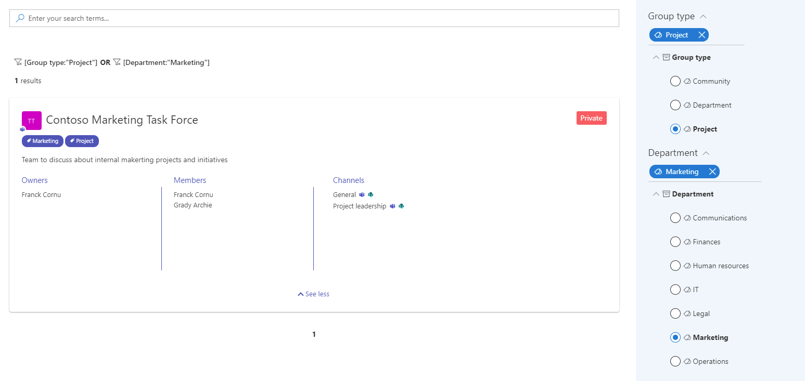{: .center}

!!! note "Questions, issues with this tutorial?"
    If you encounter issues or have questions about this tutorial, don't hesitate to reach us using our official [GitHub repository](https://github.com/aequos-solutions/modern-data-visualizer/issues/new/choose).

!!! info "Why classify teams?"

    In Microsoft Teams, there is no tagging mechanism to add custom metadata directly to a team, for instance, the type of team, related department, or even the topic. The only metadata you get is the display name and the description. It results in a poor out-of-the-box search and filtering experience in the Microsoft Teams application (web or desktop) and doesn't really help users to quickly find a relevant team when needed. This statement is even more true when an organization has a huge amount of teams and/or users are members of several teams.

    {: .center}

    In real-world scenarios, companies often have a well-defined information architecture in place and leverage SharePoint taxonomy to handle this kind of classification. The solution to bypass the Microsoft Teams limitation is generally to maintain a SharePoint list containing all created teams and use SharePoint taxonomy columns as metadata for those teams (i.e. list items). This approach works well but has a major pitfall: you need to synchronize this list every time a team is updated/created/removed. This constraint can be cumbersome at some point giving the fact Microsoft Teams doesn't offer hooks for this type of event meaning you will have to pull this information on a regular basis. Not very optimal and requires dedicated infrastructure.

    What if you could just tag your teams and filter them directly, live, from a SharePoint page or Teams application and without the need to synchronize anything?. This is precisely what you can achieve with the Modern Data Visualizer solution combined with few configurations.

The technologies used for this tutorial are:

- [Microsoft Graph schema extensions](https://docs.microsoft.com/en-us/graph/extensibility-schema-groups) (to add custom properties to teams)
- [SharePoint taxonomy](https://docs.microsoft.com/en-us/sharepoint/managed-metadata) (to define classification values)
- aequos Modern Data Visualizer solution (for the search experience)

## Step 1: Create taxonomy **term sets**

For this example, we will create two SharePoint taxonomy term sets for our teams' classification. Go to the SharePoint term store and create the following term sets and terms:

- _"Group type"_: the type of team created (Project, Community, Organizational)
- _"Department"_: the organization department associated with the team

    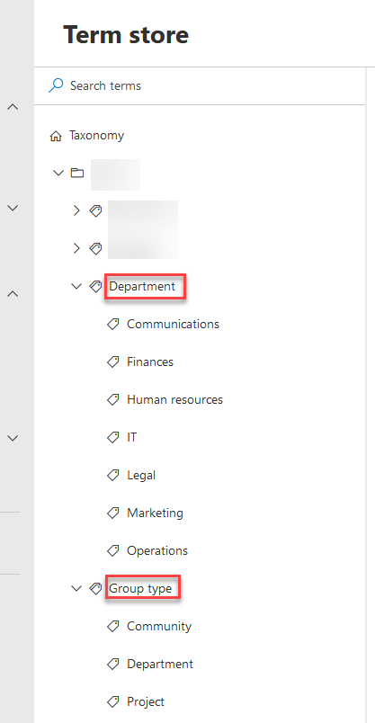{: .center}

## Step 2: Create Microsoft Graph schema extensions

To be able to set custom metadata for your Teams, you will need first to create a Microsoft Graph schema extension on the underlying `group` resource. Microsoft Graph extensions are a way provided by Microsoft to add custom data on Microsoft 365 resources (ex: `group`, `user`, etc.)

**_Why use a schema extension instead of an open extension?_**

> Simply because only schema extension can be filtered using the OData `$filter` expression. To build a search center, this could be pretty useful ;).

!!! warning
    As of today, Microsoft Schema extensions [does not support complex property types like arrays](https://docs.microsoft.com/en-us/graph/api/resources/extensionschemaproperty?view=graph-rest-1.0) and string values are limited to 256 characters. **It means teams can only be tagged with a single value per metadata**.

### Create a schema extension using Microsoft Graph Explorer

- In the same Azure Tenant where the teams you want to tag belong, create a blank Azure AD application and save its ID for later.

    !!! info
        There is no need to configure any permissions for this application.

    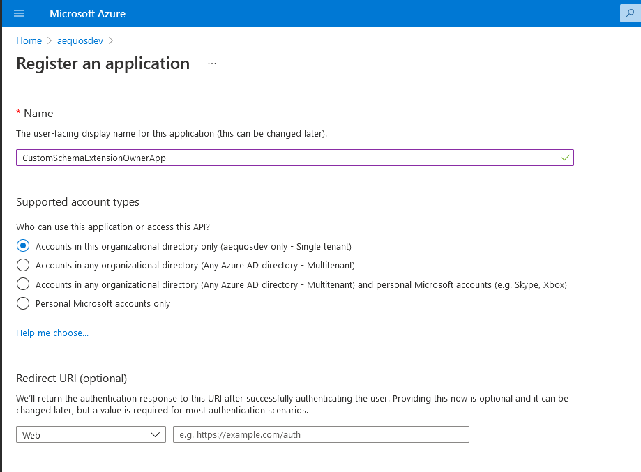{: .center}

    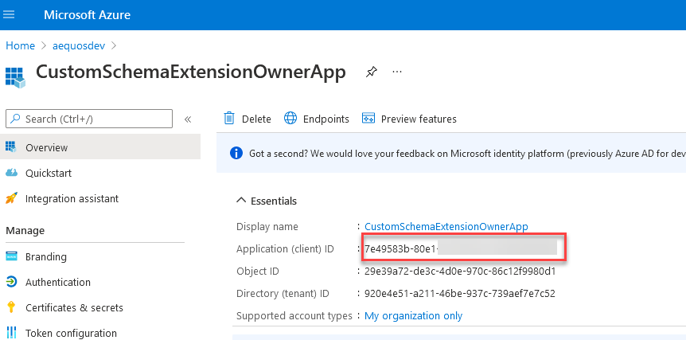{: .center}

> To be able to create a schema extension in Microsoft Graph, you need to "prove" you actually own a tenant to use it. This is done by providing a unique ID of an Azure AD application in your Active Directory at extension creation time (in the `owner` property). This application doesn't need to do more than just exist in the tenant.

- Open the [Microsoft Graph Explorer](https://aka.ms/ge) and connect with a Microsoft 365 global administrator account
- In the URL input enter `https://graph.microsoft.com/v1.0/schemaExtensions` and `POST` for the HTTP method
- On the **'Modify permissions'** tab, consent to the listed permissions:

    {: .center}

- In the **'Request body'** tab, use the following body payload with your information and press **'Run Query'**:

```json
{
    "id": "aequosGroupMetadata", // Your extension name
    "description": "Extension for Microsoft 365 groups custom metadata",
    "targetTypes": [
        "Group"
    ],
    "status": "InDevelopment",
    "owner": "7e49583b-80e1-4ea7-8bc5-xxxxxxxxx", // Replace with your own Azure AD application ID
    "properties": [
        {
            "name": "groupType",
            "type": "String"
        },
        {
            "name": "groupTypeAsText",
            "type": "String"
        },
        {
            "name": "groupDepartment",
            "type": "String"
        },
        {
            "name": "groupDepartmentAsText",
            "type": "String"
        }
    ]
}
```

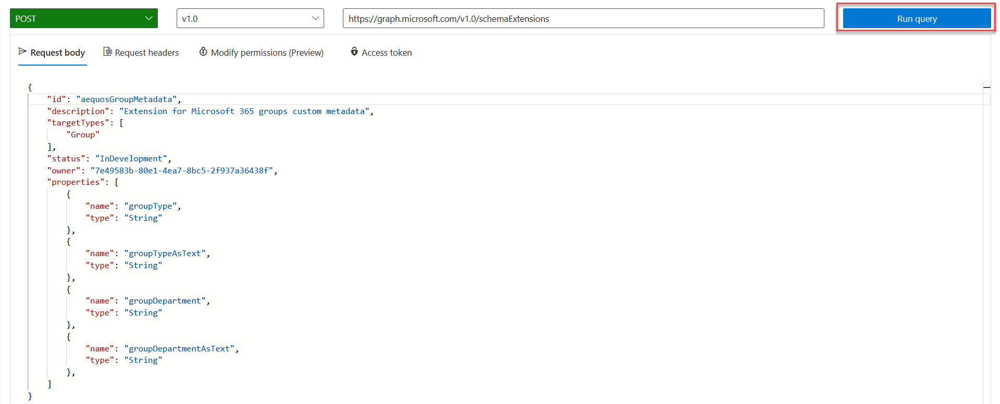{: .center}

- You should see the HTTP response like this:

    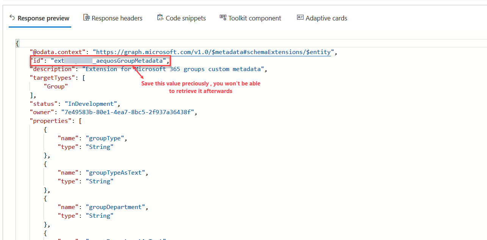{: .center}

    !!! important
        When you create your extension for the first time, you need to save its generated id **as you won't be able to retrieve it afterward**. Microsoft Graph extensions are shared across all tenants worldwide (only the definition, not values) so it will be very hard to get this value again.

## Step 3: Tag your teams with your new extension and taxonomy values

### Using the "aequos - Group/Team metadata" Web Part  

Since the **`1.4.0`**, we've added the **aequos - Group/Team metadata editor** to help you in this task. The Web Part can be used in a SharePoint page or as a tab in a team to calssify "on-demand". This way, team owners can directly update the team classification using taxonomy values (or not). Refer to the [Web Part usage](../../usage/group-tag-manager/index.md) for more information.

{: .center}

{: .center}

### Using Microsoft Graph Explorer

If you prefer do the classification manually, you can still use the Microsoft Graph explorer tool [https://aka.ms/ge](https://aka.ms/ge) or use a custom application/script to process teams as bulk. In this example, we will just show how to tag a single team using Graph Explorer. The calls remains the same for multiple teams.

- In the Microsoft Graph Explorer, get the list of your Teams using the `https://graph.microsoft.com/beta/groups?$filter=resourceProvisioningOptions/Any(x:x eq 'Team')` URL (GET) and choose one in the list you want to tag saving its `id`:

{: .center}

- In the Graph Explorer, using this ID, update the group with the SharePoint taxonomy term values by using the `https://graph.microsoft.com/v1.0/groups/<YOUR-GUID>`. As a convention, we will use the SharePoint taxonomy term IDs as the main extension properties value and the term labels for the `'AsText'` properties:

{: .center}

```json
{
    "extef3z6iep_aequosGroupMetadata": {
        "groupType": "<YOUR-PROJECT-TERM-ID>",
        "groupTypeAsText": "Project",
        "groupDepartment": "<YOUR-MARKETING-TERM-ID>",
        "groupDepartmentAsText": "Marketing"
    }
}
```

!!! info
    The `'AsText'` are mainly here for performances purpose as it avoids fetching the label again for the taxonomy ID in the Web Part layout.

## Step 4: Build a SharePoint search page using the Modern Data Visualizer Web Parts

In a SharePoint modern site (communication or team site), create a new page using the _'Home'_ layout. This can be achieved using [PnP PowerShell](https://pnp.github.io/powershell/cmdlets/Add-PnPClientSidePage.html) and the following cmdlets:

```PowerShell
Connect-PnPOnline -Url https:/<your_site_url> -UseWebLogin
Add-PnPClientSidePage -LayoutType Home -Name teams-search-mdv -CommentsEnabled:$false
```

or by using the following [CLI for Microsoft 365](https://pnp.github.io/cli-microsoft365/cmd/spo/page/page-set/) commands:

```bash
m365 login
m365 spo page add --name teams-search-mdv.aspx --webUrl https:/<your_site_url> --layoutType Home
```

> We use the this layout for convenience as it fits well to build search pages.

- Add needed Graph permissions for the Modern Data Visualizer SPFx Web Parts. This can be achieved using [Microsoft 365 CLI](https://pnp.github.io/cli-microsoft365/) and the following commands:

```bash
m365 login
m365 spo serviceprincipal grant add --resource 'Microsoft Graph' --scope 'GroupMember.Read.All'
m365 spo serviceprincipal grant add --resource 'Microsoft Graph' --scope 'Channel.ReadBasic.All'
m365 spo serviceprincipal grant add --resource 'Microsoft Graph' --scope 'User.Read'
```

- Go and edit the newly created page and change the layout to be 'Vertical section':

{: .center}

- On the main zone, add a _Search Box Web Part_:

{: .center}

- On the right zone, add a _Data Filters Web Part_ with the following configurations:

{: .center}

!!! example "Data Filters Web Part configuration"

    {: .center}

    | Display Name | Filter field | Template |
    | ------------ | ------------ | -------- |
    | **Group type** | &lt;your_schema_extension_name&gt;/groupType (ex: `exttumpwrak_aequosGroupMetadata/groupType`) | "Taxonomy picker" wired to the _"Group type"_ term set:<br /> 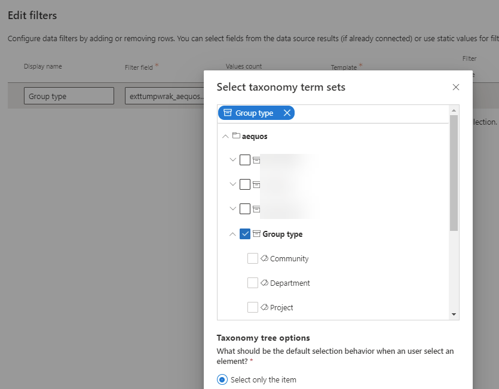{: .center}
    | **Department** | &lt;your_schema_extension_name&gt;/groupDepartment (ex: `exttumpwrak_aequosGroupMetadata/groupDepartment`) | "Taxonomy picker" wired to the _"Group type"_ term set:<br /> {: .center}

- On the main zone, below the search box, add a new _Data Visualizer Web Part_ with the following configurations (in this order):

!!! example "Data Visualizer Web Part configuration"

	=== "1. Data source"

        Select the "OData" source using Microsoft Graph:

        {: .center}

        Configure the source with the following values:

        - **Url**:
            ```
            https://graph.microsoft.com/beta/me/memberOf/$/microsoft.graph.group?$top={itemsCountPerPage}&$count=true&$select=exttumpwrak_aequosGroupMetadata,id,displayName,description,visibility${if(empty("{inputQueryText}"),'','&$search="displayName:{inputQueryText}" OR "description:{inputQueryText}"')}${if(empty('{filters}'),"&$filter=resourceProvisioningOptions/Any(x:x eq 'Team')",concat("&$filter=resourceProvisioningOptions/Any(x:x eq 'Team') and ", buildOdataFilterCondition(json('{filters}'))))}
            ```

            > You must replace the `exttumpwrak_aequosGroupMetadata` value with your own extension name created earlier. Also, don't forget to click "Apply".

            This URL could seem intimidating but leverages both Microsoft adaptive expressions and built-in Web Part [tokens](../../../usage/data-visualizer/tokens/) to create a dynamic query depending on the connected search box and filter values. Decorticated, the query does the following:
            ***
            - Retrieve the Microsoft 365 groups where the user is a member<br />
                `https://graph.microsoft.com/beta/me/memberOf/$/microsoft.graph.group?`
            ***
            - Return a specified number of results according to the Web Part configuration<br />
                `$top={itemsCountPerPage}`
            ***
            - Return the number of results for the search<br />
                `&$count=true`
            ***
            - Return useful properties for a team used by the 'Teams' layout, including the custom schema extension you created earlier (to be replaced by your own value)<br />
                `&$select=exttumpwrak_aequosGroupMetadata,id,displayName,description,visibility`
            ***
            - Add a $search condition on display name and description only if a keyword is entered in the search box. Leave blank otherwise<br />
                ```
                ${
                    if(empty("{inputQueryText}"),
                        '',
                        '&$search="displayName:{inputQueryText}" OR "description:{inputQueryText}"'
                    )
                }
                ```
            ***
            - Add a $filter condition only if filter values are present and selected. Leave blank otherwise. The `buildOdataFilterCondition()` function converts the current filter values to an OData valid `$filter` condition using 'eq' operator.<br />
                ```
                ${
                    if(empty('{filters}'),
                        "&$filter=resourceProvisioningOptions/Any(x:x eq 'Team')",
                        concat("&$filter=resourceProvisioningOptions/Any(x:x eq 'Team') and ", buildOdataFilterCondition(json('{filters}')))
                    )
                }
                ```

        - HTTP Method: `GET`
        - HTTP headers:
            ```json
            {
                "Content-Type": "application/json;odata=verbose",
                "Accept": "application/json",
                "ConsistencyLevel": "eventual"
            }
            ```

    === "2. Connections"

        Connect to the Data Filters Web Part and the Search box on the same page:

        {: .center}

	=== "3. Layout"
        Select the "Teams" layout from the layout configuration page.
        In the options, select the `AsText` properties from your schema extension:

        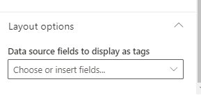{: .center}

        {: .center}


- Connect the Data Filters Web Part to the Data Visualizer Web Part:

    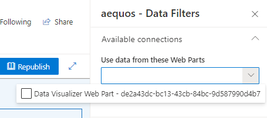{: .center}

Congratulations, you have now a functional search center for your teams!

## Step 5: Create a Teams application and deploy it to your users

To fully integrate the search experience directly in Microsoft Teams, you can create a new application and deploy it globally for your users inside your organization.

1. Open Microsoft Teams in web or desktop mode. In the app bar, click on **(...)** and search for the application named **"App Studio"**:

    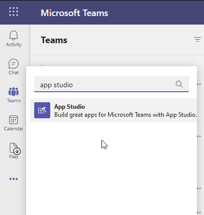{: .center}

2. Create a new application (ex: _"Teams search"_):

    {: .center}

3. Fill the required information and leave the other settings by default:

    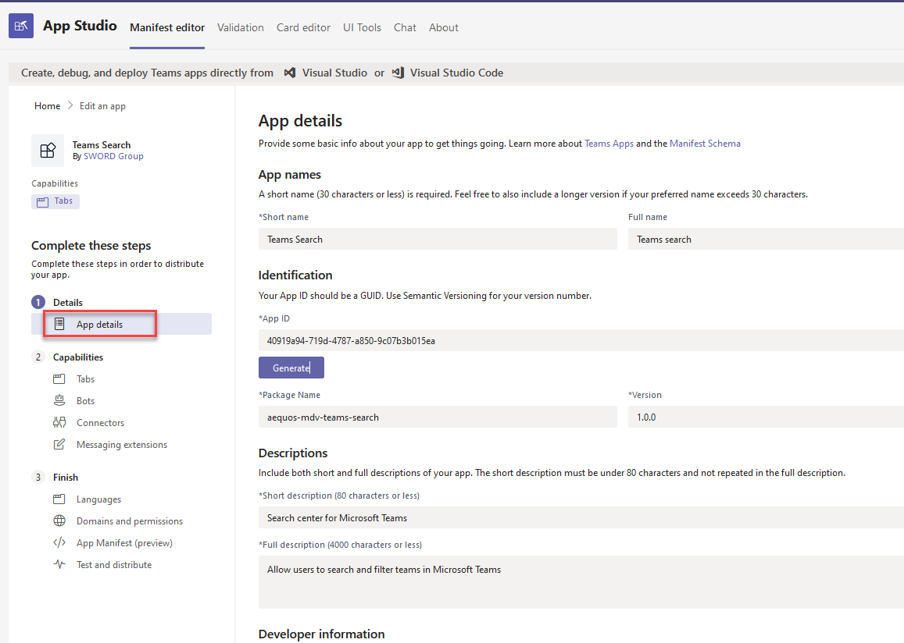{: .center}

    | Settings          | Example value
    | ----------------- | ---------------------|
    | **Package Name**  | _aequos-mdv-teams-search_
    | **Version**       | _1.0.0_
    | **Short description** | _Search center for Microsoft Teams_
    | **Full description**  | _Allow users to search and filter teams in Microsoft Teams_
    | **Developer/Company Name**    |  _SWORD Group_
    | **Website**   | _https://www.sword-group.com_
    | **Privacy statement** | _https://www.sword-group.com_
    | **Terms of use**  | _https://www.sword-group.com_

4. In the **'Tabs'** section, add a personal tab with the following information:

    | Settings          | Example value
    | ----------------- | ---------------------|
    | **Name**  | _Team search application_
    | **Entity ID**  | _teamsSearch_
    | **Content URL**| `https://<your_tenant>.sharepoint.com/_layouts/15/teamslogon.aspx?spfx=true&dest=https://<your_tenant>.sharepoint.com/sites/<your_sharepoint_site>/SitePages/teams-search-mdv.aspx`

    > You must replace &lt;your_tenant&gt; and &lt;your_sharepoint_site&gt; by the values corresponding to your environment.

    {: .center}

    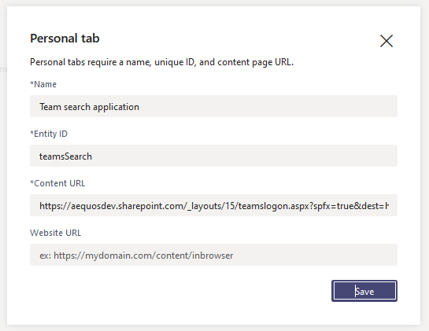{: .center}

5. In the **'Domains and premissions'** section, configure the SSO setting with the following information:

    | Settings          | Example value
    | ----------------- | ---------------------|
    | **AAD App ID**  | `00000003-0000-0ff1-ce00-000000000000` (ID of the SharePoint Azure AD application. It is the same for everyone)
    | **Single-Sign-On** | _https://&lt;your_tenant&gt;.sharepoint.com_ (replace by your own value)


6. Click **'Test and distribute'** and then **Install** to validate the application is working. You can now [package this app and deploy it for your users globally](https://docs.microsoft.com/en-us/MicrosoftTeams/manage-apps):

    {: .center}

    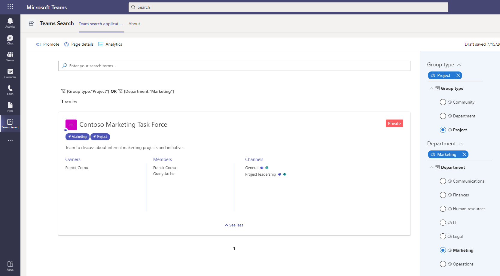{: .center}

## What's next?

This tutorial gave you a straightforward approach to add custom metadata to your teams in Microsoft Teams. The next step is to classify all your teams accordingly using the Microsoft Graph schema extension so you can filter them using this interface. This can be achieved using multiple ways (CSV + PowerShell, SPFx extension, [aequos Group/Team metadata editor](../../usage/group-tag-manager/index.md) but this is outside of the purpose of this article.

!!! note "Questions, issues with this tutorial?"
    If you encounter issues or have questions about this tutorial don't hesitate to reach us using our official [GitHub repository](https://github.com/aequos-solutions/modern-data-visualizer/issues/new/choose).