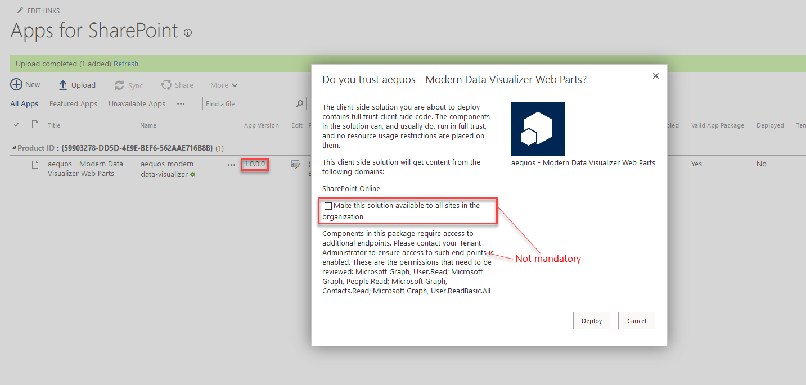
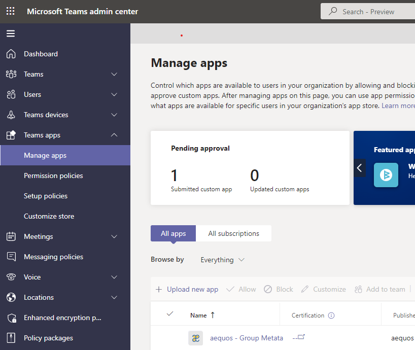

# Installation

!!! info "Trial version"
    If you don't have a valid license when using one of the Web Parts for the first time in a page, **a 14 days trial period will automatically begin associated to your Microsoft 365 tenant ID**. You don't need to provide any credit card or personal information, simply follow the steps below to start using the solution. At the end of the trial period, a license validation message will appear preventing using the Web Parts anymore. To continue to use them, you must purchase a valid license. 

    {: .center}
    
    Trial periods are not cumulative. However, if you need more time to complete you evaluation simply contact us directly at [contact@aequos.ca](mailto:mdv@sword-group.com).

1. Download the latest SharePoint Framework package (**aequos-modern-data-visualizer.sppkg**) from our public [GitHub repository](https://github.com/aequos-solutions/modern-data-visualizer/releases).
2. Add the package to your global app catalog or site collection app catalog. If you don't have an app catalog, follow this [procedure](https://docs.microsoft.com/en-us/sharepoint/use-app-catalog) to create one.

    {: .center}

    > * The solution is deployed in the general Micraosoft 365 CDN meaning **we don't host any code on our side**.

    > * You can choose to make the solution available in [all sites](https://docs.microsoft.com/en-us/sharepoint/dev/spfx/tenant-scoped-deployment) or force to install an app to the site every time.

    !!! note "Asked API permissions"
        The solution asks the following API permissions by default to enhance the experience. 
        
        **Mandatory permissions**

        | Requested API permission | Used for |
        | -------------- | --------- |
        | _TermStore.Read.All_ | The taxonomy picker filter template. Without it, users won't be able to browse for terms and term sets in the taxonomy tree.

        **Not mandatory permissions**
        
        The following permissions are **not mandatory**. If you don't accept them, you will simpy have less available features.

        | Requested API permission | Used for |
        | -------------- | --------- |
        | _User.Read_ | The Microsoft Graph Toolkit [persona card](https://docs.microsoft.com/en-us/graph/toolkit/components/person-card#microsoft-graph-permissions) in the people layout.  |
        | _People.Read_ | Same as above.
        | _Contacts.Read_ | Same as above.
        | _User.ReadBAsic.All_ | Same as above.
        | _GroupMember.Read.All_ | To list owners and members in the Teams layout panel.
        | _Channel.ReadBasic.All_ | To list channels in the Teams layout panel.
        | _Group.ReadWrite.All_ | To be able to update Microsoft Graph schems extensions with the Group/Team metadata editor Web Part.
        | _Files.Read.All_ | Microsoft Search API
        | _Sites.Read.All_ | Microsoft Search API
        | _Mail.Read_ | Microsoft Search API
        | _Calendars.Read_ | Microsoft Search API
        | _ExternalItem.Read.All_ | Microsoft Search API

    !!! important "Microsoft Teams deployment"
        If you plan to use the **aequos - Team/Group metadata editor** solution in Microsoft Teams, you must deploy the `.sppkg` file in the **tenant** app catalog and use the **"Sync to Teams"** ribbon button:

        {: .center}

        Once deployed, you should see the application in the Teams application catalog:

        {: .center}
   
3. Add the Web Parts to a SharePoint and start building. Easy no?

{: .center}