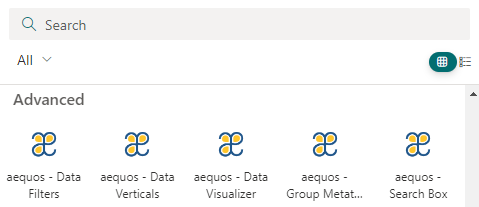
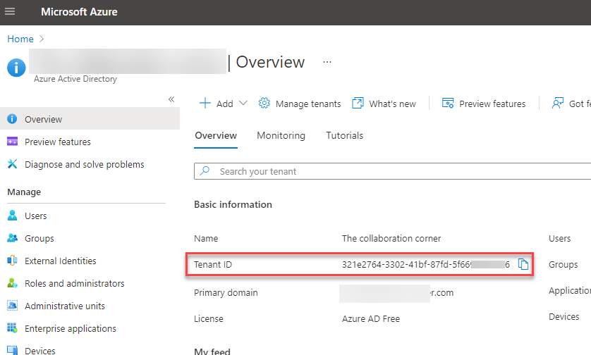
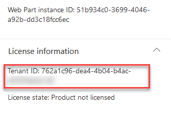

# Installation

1. Download the latest SharePoint Framework package (**aequos-modern-data-visualizer.sppkg**) from our public [GitHub repository](https://github.com/aequos-solutions/modern-data-visualizer/releases).
2. Add the package to your global app catalog or site collection app catalog. If you don't have an app catalog, follow this [procedure](https://docs.microsoft.com/en-us/sharepoint/use-app-catalog) to create one.

    {: .center}

    > * The solution is deployed in the general Office 365 CDN meaning **we don't host any code on our side**.

    > * You can choose to make the solution available in [all sites](https://docs.microsoft.com/en-us/sharepoint/dev/spfx/tenant-scoped-deployment) or force to install an app to the site every time.

    > * The solution asks the following API permissions by defailt to enhance the experience. These permissions are **not mandatory**. If you don't accept them, you will simpy have less available features.

    | Requested API permission | Used for |
    | -------------- | --------- |
    | _User.Read_ | The Microsoft Graph Toolkit [persona card](https://docs.microsoft.com/en-us/graph/toolkit/components/person-card#microsoft-graph-permissions) in the people layout.  |
    | _People.Read_ | Same as above.
    | _Contacts.Read_ | Same as above.
    | _User.ReadBAsic.All_ | Same as above.

3. Get a valid license from our [website](https://www.aequos.ca). 

    {: .center}

    Register **the Office 365 tenant ID where you want to use this solution**. If you don't know how to get your tenant ID, you can refer to this [procedure](#get-your-office-365-tenant-id)

    > **If you chose a standalone license, you must follow these [additional steps](./setup_standalone.md).**

4. Add the Web Parts to a SharePoint and start building!

{: .center}

## Get your Office 365 tenant ID

To get your Office 365 tenant unique ID, you can:

- Follow this [procedure](https://docs.microsoft.com/en-us/onedrive/find-your-office-365-tenant-id) OR
- [Download](https://github.com/aequos-solutions/modern-data-visualizer/releases), deploy and use Web Parts without license and get the tenant ID from the error message or in the third Web Part configuration page:

{: .center}

{: .center}