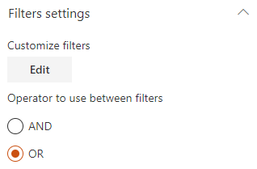
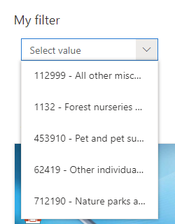

# Data Filters Web Part

The 'Data Filters' Web Part allows to filter the current results displayed in a 'Data Visualizer' Web Part. This component is higly configurable to meet you requirements and it works for all data sources.

{: .center}

{: .center}

## Configuration

### Connection

To use the data filters, we must first connect it to one or multiple 'Data Visualizer' Web Parts. In the other hand, you must conenct back those Web Parts to the 'Data Filters' one. It is a **two-ways connection**.

{: .center} 

If you connect more than one Web Part, the filter values and counts will be merged for similar filter names:

**Example**

**DataSource1** and **DataSource2** expose respectively a _'FileType'_ filter with values and counts `value1:1`, `value2:1` for **DataSource1** and `value2:1`, `value4:1` for **DataSource2** and both are connected to the filters Web Part. In this case, a single _'FileType'_ filter name will be displayed (because the filter name is the same) with values `value1:1`,`value2:2`,`value3:1`,`value4:1`. If you select a value that is not present in a data source (ex: `value1` for data source #2), you will simply get zero result.

### Filter settings

From the filter settings, you can customize individual filters and the operator to use between filters (**OR** or **AND**).

{: .center}

For each filter, the available options are as follow:

{: .center} 

| **Setting** | **Description** |
|------------|-----------------|
| **Display Name** | A friendly name for the filter |
| **Filter field** | The internal data source field to use as filter. Here you can select a field from the current data source (if data have been already retrieved) of type your own custom value (press enter to validate).
| **Template** | The template to use to display filter values. See [Filter templates](#filter-templates).
| **Filter type** | Specify if the filter is a 'static' filter or a 'refiner' filter. See below for more information.
| **Expand by default** | If applicable for the selected template, display values as expanded.
| **Show count** | If applicable for the selected template, display counts for values.
| **Mutli values** | If applicable for the selected template, allow selection of multiple values.
| **Operator between values** | If multi values is selected, the operator to use between values (OR/AND).
| **Sort values by** | Sort values by name or by count.
| **Sort direction** | Sort values in ascending/descending order.

### <a name=filter-templates>Filter templates</a>

| **Template** | **Overview** |
|------------|-----------------|
| Checkbox | 
| Date interval | 
| Date range | 
| Combo box | 
| Taxonomy picker   ([Configuration details](./templates/taxonomy-picker)) |    For more information about taxonomy picker configuration, click [here](./templates/taxonomy-picker).

## Filter types: 'Static' filter versus 'Refiner' filter

The Web Part supports two types of filters (_'Static'_ and _'Refiner'_). However, there are some differences that are important to understand between these two if you want to use them properly:

- **Refiner**: a 'Refiner' filter means the filter gets its values from the data source and sends back the selected ones the data source. If the data source has no result, there won't be any refiner values, simple as that.
- **Static filter**: a 'Static' filter means the filter doesn't care about filter values sent by the data source and provides its own arbitrary values regardless of input values. A date range picker or a taxonomy picker (or any picker) are good examples of what an 'Static' filter is. Such a filter do not need necessarily need a Data Visualizer connection.

!!! note
    The filter type is indicated for each filter. 
    

## Use indexed property bag properties with taxonomny values

> **This behavior only works with the SharePoint Search Data source and the _Enabled localization_ flag activated.**

Using an indexed property bag value could be useful to store information about a SharePoint site or other element that can't be tagged with a taxonomy value directly. The 'Modern Data Visualizer' solution supports property bag properties values that use the following taxonomy value format to be able to filter on them (ex: a taxonomy multi values separated by a semicolon (;)):

`L0|#a2cf1afb-44b6-4cf4-bf37-642bb2e9bff3|Category 1;L0|#02e3406c0-1048-4bce-90eb-e7a51dfa7f31|Category3;L0|#07e094327-23d7-48af-9699-781eb26dc40f|Category2`

These taxonomy values can then be used in the Data Filters Web Part using a `RefinableStringXX` search managed property to filter specific sites or elements. As an example, you can refer to the ["Create an end-to-end Office 365 groups provisioning solution"](https://github.com/pnp/tutorial-workspace-provisioning) tutorial GitHub project to leverage this format.

