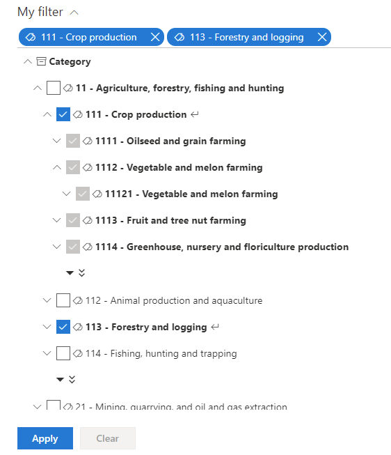
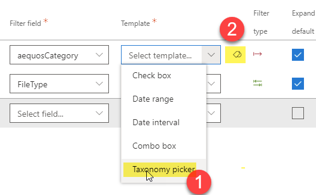
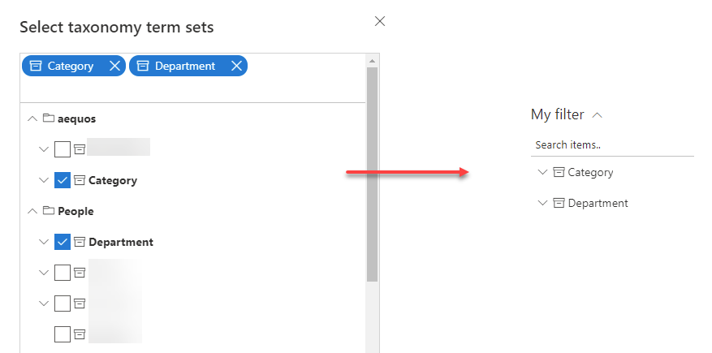
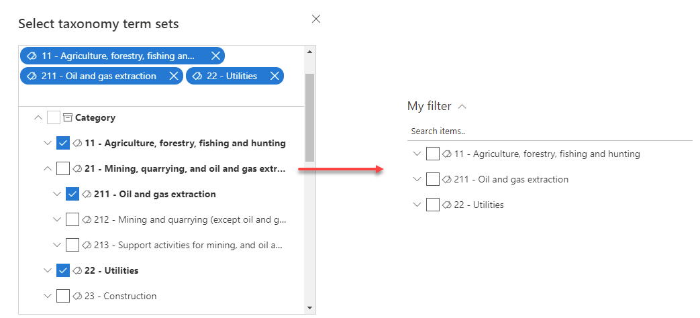
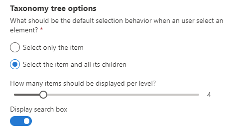
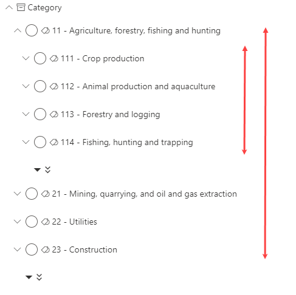
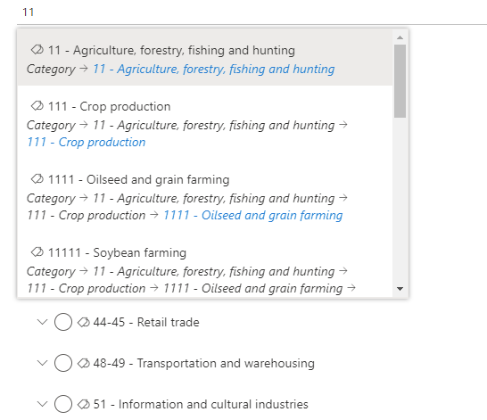

# Data Filter Web Part - Taxonomy Picker template

The taxonomy picker template allows you to filter data using the SharePoint Term Store using your own information architecture.

{: .center} 

## Configure the taxonomy picker

To configure the taxonomyp picker, follow these steps:

1. From the Data Filter Web Part **'Edit'** button in the Web Part property pane, select the _Taxonomy picker_ template from the dropdown list and click on the tag icon next to it to view setings:

    {: .center} 

1. Select anchor terms or term sets you want to display as filters for users. They will be displayed as root elements for the filter name in the Web Part. You have here the flexibility to mix term sets from different term groups or anchor terms from same or different term sets:

    **Example with term sets:**

    {: .center}

    **Example with anchor terms**

    {: .center} 

    !!! note

        - Even though there is no technical limitation regarding the number of anchor terms or term sets you can display as root filters, we strongly recommend to limit this number to only few items to avoid performance issues or split into multiple filters.

        - Only items with the same type can be used as root filters (i.e. only term sets or terms, not both at the the time).

3. Configure behavior settings with the provided options:

    {: .center} 

    | **Setting** | **Description** |
    |------------|-----------------|
    | **Item selection behavior** | Determine the default selection behavior when a user select the value. This settings can also be overriden per value for more flexibility:    {: .center} |
    | **Number of items per page** | Determine the number of items to show per taxonomy levels. An high value will have impact on performances.    {: .center} |
    | **Display search box** | Determine if a search box should appear in the picker letting users search for values. When an user search for values, the scope is restricted to term sets or anchor terms configured as root and does not apply to the whole term store. Also, the search is performed **using the current UI language**.    {: .center} |