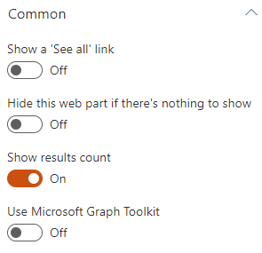
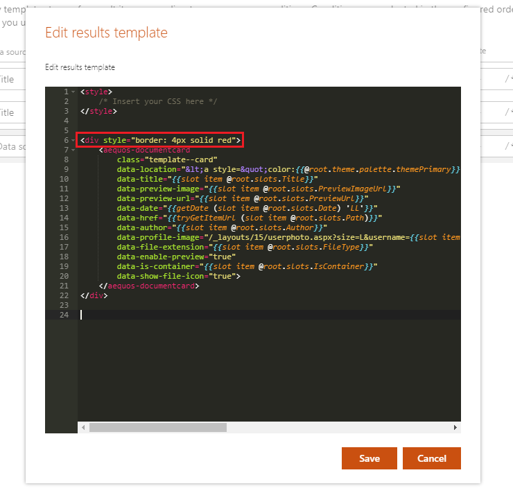
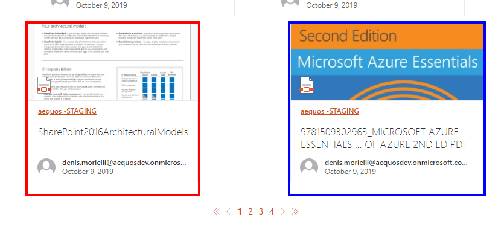

## Builtin layouts

By default, the following layouts are provided:

{: .center}

> Be careful, when you switch the layout in the property pane, all the previous layout properties are lost. We do this to avoid polluting the Web Part property bag with multiple useless configurations.

### Cards

{!usage/data-visualizer/layouts/cards.md!}

### Details List

{!usage/data-visualizer/layouts/details-list.md!}

### Slider

{!usage/data-visualizer/layouts/slider.md!}

### Simple list

{!usage/data-visualizer/layouts/simple-list.md!}

### People

{!usage/data-visualizer/layouts/people.md!}

### Debug

{!usage/data-visualizer/layouts/debug.md!}

### Custom

{!usage/data-visualizer/layouts/custom.md!}

## Common settings

For all layouts, some common settings are available:

{: .center}

| Setting | Description | Default value 
| ------- |---------------- | ---------- |
| **Show a 'See all' link** | Allows you to specify a 'See all' link at the top right of the Web Part along the Web Part title. You can set the text that will appear plus the link to use. Tokens are supported in the link URL. <p align="center"></p> | Disabled.
| **Hide this web part if there's nothing to show** | If there is no results, the Web Part will remain blank in display mode (title and 'See all' link included). In edit mode, you will see a message indicating there is no results. <p align="center"></p> | Disabled.
| **Show results count** | Hide or display the results count for the current query. | Enabled.
| **Use Microsoft Graph Toolkit** | Enable or disable the Microsoft Graph Toolkit to be used in Handlebars template. Refer to the [MGT documentation](https://docs.microsoft.com/en-us/graph/toolkit/overview) to see available components.

### Result types

The result types feature gives you the ability to apply a conditional rendering at item level according to data source field values.

{: .center}

> Not all layouts support the result types feature (ex: Details lsit and slider layouts).

**Example**

Given the following conditions, we apply a border with a specific color for each: 

{: .center}

{: .center}

The result would be like this:

{: .center}

The following operators are supported:

- Equals
- Not equals
- Contains
- StartsWith
- Greater Or Equal
- Less Or Equal
- Less than
- Greater than
- Is not null

In the case you use a custom template, you can still benefit from this feature following this markup:

```html
{{#> resultTypes}}
  {{!-- The block below will be used as default item template if no result types matched --}}
  <div class="template_result">
      <!-- Your default template markup -->
  </div>
{{/resultTypes}}
```

Handlebars [partials](https://handlebarsjs.com/partials.html) are used behind the scenes and conditions are built dynamically using a recursive if/else structure.

