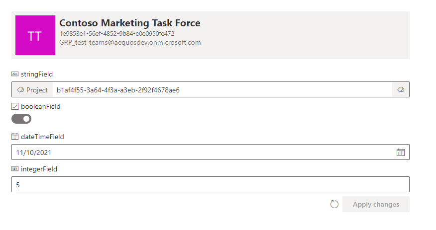
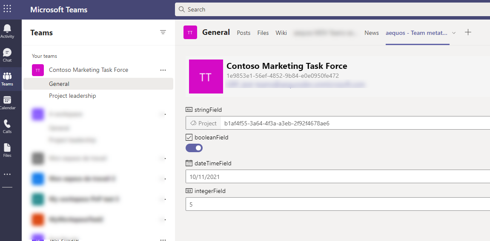
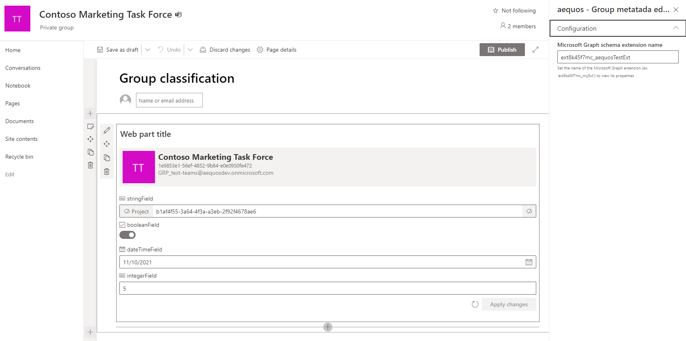
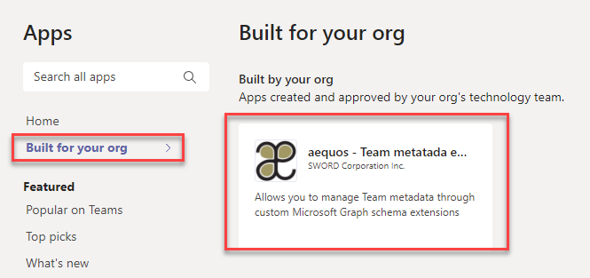
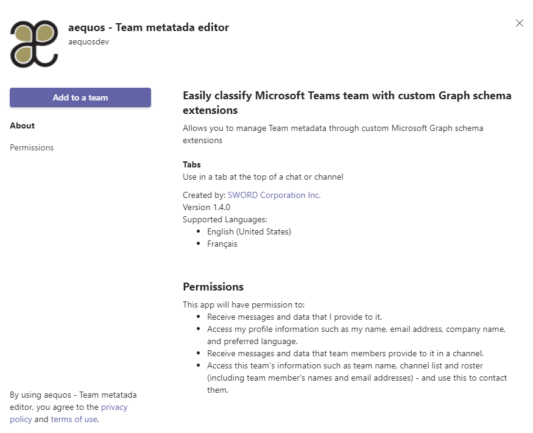
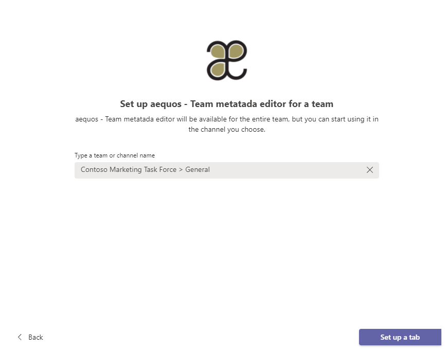

# Group metadata editor

> This Web Part is available since the **`1.4.0`** version.

The _'Group/Team metadata editor' Web Part_ allows you to tag a specific Microsoft 365 group or team using a custom Microsoft Graph schema extension. This Web Part can be used **in a regular SharePoint page** or **as a team tab in Microsoft Teams** with the provided application (see [Installation](../../installation.md) for more information). 

> Although it can be used alone, we designed this Web Part to fully complete the search experience and provide an end-to-end solution with other MDV components when used to build a team search center in Microsoft Teams. See this [tutorial](../../getting_started/tutorials/build_teams_search_portal_using_taxonomy.md) to know how you can leverage this component at its full potential.

{: .center}

{: .center}

!!! note

    - This Web Part can only be used in a SharePoint team site connected to a Microsoft 365 group and/or in a tab in a Microsoft Teams team. A warning message will be displayed otherwise: 

    {: .center}

    - Only an owner of the underlying  Microsoft 365 group can configure schema extension properties.

## Configuration

The Microsoft Graph schema extension **must be created before using this Web Part**. As a tenant administrator, you can use [Microsoft Graph explorer](https:/aka.ms/ge) and this [procedure](https://docs.microsoft.com/en-us/graph/extensibility-schema-groups) to create an extension. 

The Web Part supports the following property data types:

- `String`
- `Integer`
- `DateTime`
- `Boolean`

## Usage in a SharePoint site

1. In a SharePoint team site **connected to a Microsoft 365 group**, open or create a new page.

2. Add the _"aequos - Group metadata editor"_ Web Part on the page and set the schema extension name.

    {: .center}

## Usage in a team in Microsoft Teams

1. On a team channel, add a new tab and click on _"More apps"_. If correctly deployed by your administrator, you should see the **"aequos - Team metadata editor"** application listed in your organization applications.

    {: .center}

    {: .center}

2. Go through the process to add the application as tab:

    {: .center}

    {: .center}

    {: .center}

3. Configure the component settings the same way as the SharePoint Web Part:

    {: .center}

